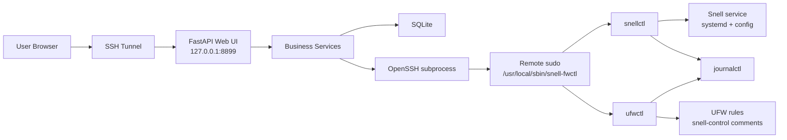

# snell-ufw-control V1 Design

## Purpose

`snell-ufw-control` is a local-only control center for managing Snell Server nodes and the UFW allowlists that protect each node's Snell port.

The project is intentionally narrow:

- Manage Snell installation, configuration, service state, and logs on multiple VPS nodes.
- Manage Snell-port UFW allowlists through relay groups and node policies.
- Run the Control Center only on `127.0.0.1:8899`.
- Access the Control Center through an SSH Tunnel.
- Avoid becoming a general VPS panel or a public web management surface.

## Technology Stack

- Python FastAPI.
- SQLite.
- Jinja2 + HTMX.
- systemd.
- OpenSSH subprocess calls for remote execution.
- Node-side restricted Python tools.
- No React, Vue, or Node.js in V1.

## Architecture



The Control Center stores desired state in SQLite. Remote nodes hold actual state: installed Snell binaries, Snell configuration, systemd status, logs, and UFW rules. The UI can compare and refresh actual state through fixed SSH calls.

## Repository Layout

```text
snell-ufw-control/
├── app/
│   ├── main.py
│   ├── config.py
│   ├── db.py
│   ├── models.py
│   ├── schemas.py
│   ├── services/
│   │   ├── nodes.py
│   │   ├── relay_groups.py
│   │   ├── policies.py
│   │   ├── ssh_executor.py
│   │   ├── ufw_parser.py
│   │   └── audit.py
│   ├── templates/
│   └── static/
├── node/
│   ├── snell-fwctl
│   ├── snellctl
│   └── ufwctl
├── systemd/
│   └── snell-ufw-control.service
├── scripts/
│   ├── install-controller.sh
│   └── install-node.sh
├── data/
├── docs/
├── README.md
└── AGENTS.md
```

## Security Model

- The web service defaults to `127.0.0.1:8899`.
- The project does not open a public management port.
- Users access the UI through SSH Tunnel.
- The controller still requires minimal authentication and CSRF protection. Localhost binding is not treated as authentication.
- The Control Center never exposes arbitrary command execution.
- Nodes use a dedicated `snellmgr` user.
- Nodes do not use root SSH login for management.
- `sudoers` allows `snellmgr` to execute only `/usr/local/sbin/snell-fwctl` with `NOPASSWD`.
- The security boundary is the restricted `snell-fwctl` command allowlist, root-owned tool files, JSON stdin validation, a fixed execution environment, and no arbitrary command support.
- Node-side tools accept only fixed subcommands.
- Config and policy payloads are passed through stdin JSON.
- No `eval` or shell string composition is allowed in the remote execution path.
- UFW operations only manage rules whose comment starts with `snell-control:`.
- UFW backups are created before every UFW modification.
- Snell configuration backups are created before Snell config changes.
- SQLite may contain Snell PSKs; `data/` should be mode `700`, and database files should be mode `600`.

## Controller Authentication

V1 uses a minimal local-admin model, not a multi-user account system.

- `ADMIN_TOKEN` is generated by `install-controller.sh` unless explicitly provided.
- `SESSION_SECRET` is generated by `install-controller.sh` unless explicitly provided.
- The login form accepts the admin token and creates a signed session cookie.
- Session cookies must be `HttpOnly` and `SameSite=Lax` or `SameSite=Strict`.
- Every state-changing route must require a CSRF token, including create, edit, delete, install, restart, apply, restore, promote, and enable actions.
- Read-only routes may require authentication but do not need CSRF.
- Failed login and failed CSRF checks are recorded in `AuditLog` without storing submitted secrets.

## Node-Side Tooling

There is one sudo entry point:

```text
/usr/local/sbin/snell-fwctl
```

Internally, this dispatches to two Python tools:

```text
/usr/local/lib/snell-ufw-control/snellctl
/usr/local/lib/snell-ufw-control/ufwctl
```

`snell-fwctl` is responsible for:

- validating the namespace: `snell` or `ufw`;
- validating the subcommand allowlist;
- forwarding stdin JSON to the correct internal tool;
- running with a fixed safe environment such as `PATH=/usr/sbin:/usr/bin:/sbin:/bin`;
- rejecting unknown arguments rather than passing them through;
- returning a normalized JSON result.

### Supported Commands

```text
snell-fwctl snell install
snell-fwctl snell status
snell-fwctl snell start
snell-fwctl snell stop
snell-fwctl snell restart
snell-fwctl snell config-get
snell-fwctl snell config-apply
snell-fwctl snell logs
snell-fwctl snell backup
snell-fwctl snell restore

snell-fwctl ufw list
snell-fwctl ufw apply
snell-fwctl ufw backup
snell-fwctl ufw restore
snell-fwctl ufw candidates
snell-fwctl ufw enable
```

### JSON Response Contract

Success:

```json
{
  "ok": true,
  "data": {},
  "error": null
}
```

Failure:

```json
{
  "ok": false,
  "data": {},
  "error": {
    "code": "SNELL_INSTALL_FAILED",
    "message": "..."
  }
}
```

## Data Model

### Node

- `id`
- `name`
- `host`
- `ssh_alias`
- `ssh_port`
- `ssh_user`
- `ssh_key_path`
- `connect_timeout`
- `snell_port`
- `snell_version`
- `snell_channel`
- `snell_arch`
- `enable_tcp`
- `enable_udp`
- `remark`
- `enabled`
- `desired_config_text`
- `psk`
- `created_at`
- `updated_at`
- `last_seen_at`
- `last_status`
- `last_error`

At least one of `enable_tcp` and `enable_udp` must be true. Defaults are both true.

SSH connection mode:

- Prefer `ssh_alias` from the user's OpenSSH config.
- If `ssh_alias` is present, the SSH executor may omit `host`, `ssh_user`, `ssh_port`, and `ssh_key_path` from the command and let OpenSSH resolve them.
- If field-based connection is used, validate `host`, `ssh_user`, `ssh_port`, optional `ssh_key_path`, and `connect_timeout`.
- Do not store private key contents or key passphrases in SQLite.
- `host` must not start with `-`.
- `ssh_user` must match a conservative Linux username pattern.
- `ssh_port` and `snell_port` must be in `1..65535`.
- IP and CIDR values must be validated through Python's `ipaddress` module.

### SnellConfigProfile

- `id`
- `name`
- `snell_port`
- `snell_version`
- `snell_channel`
- `snell_arch`
- `enable_tcp`
- `enable_udp`
- `psk`
- `config_text`
- `remark`
- `created_at`
- `updated_at`

Profiles are used for creation and copying only in V1. Editing a profile does not automatically update existing nodes.

### RelayGroup

- `id`
- `name`
- `remark`
- `created_at`
- `updated_at`

### RelayIP

- `id`
- `relay_group_id`
- `value`
- `remark`
- `created_at`

`value` may be an IP address or CIDR.

### NodePolicy

- `id`
- `node_id`
- `relay_group_id`
- `enabled`
- `created_at`
- `updated_at`

### AccessCandidate

- `id`
- `node_id`
- `ip`
- `port`
- `protocol`
- `first_seen_at`
- `last_seen_at`
- `hit_count`
- `source`
- `promoted`
- `promoted_relay_group_id`

### AuditLog

- `id`
- `actor`
- `action`
- `target_type`
- `target_id`
- `summary`
- `request_json`
- `result_json`
- `success`
- `error`
- `created_at`

`request_json` and `result_json` must be passed through a centralized `redact_sensitive(obj)` function before storage. Redaction covers:

- `psk`;
- `password`;
- `private_key`;
- `config_text`;
- `desired_config_text`;
- any Snell config line containing `psk`;
- future fields whose names contain obvious secret markers.

The UI must never display full PSKs in audit log views.

### OperationLock

- `node_id`
- `operation_type`
- `locked_at`
- `owner`
- `expires_at`

V1 may implement the lock in SQLite. Only one write operation per node may run at a time. Write operations include:

- `snell install`;
- `snell config-apply`;
- `snell start`;
- `snell stop`;
- `snell restart`;
- `snell restore`;
- `ufw apply`;
- `ufw restore`;
- `ufw enable`.

Read operations such as `status`, `logs`, `ufw list`, and `ufw candidates` may run concurrently.

### Future NodeSnapshot

V1 does not need a `NodeSnapshot` table. Future versions may add one for traffic, speed, connection counts, and other Snell-related observations without turning the product into a general VPS panel.

## Snell Configuration

The UI provides a default Snell configuration. Users can also edit or paste their own config.

V1 supports:

- automatic strong PSK generation;
- user-provided PSK;
- copied PSK across multiple nodes;
- config profiles for defaults and reusable presets;
- node-specific config copies;
- explicit Snell version or channel selection;
- explicit architecture selection when needed;
- TCP and UDP firewall toggles.

Recommended UI behavior:

- form mode for common fields such as port, PSK, TCP, UDP, and remark;
- advanced mode for raw Snell config text;
- version selection with explicit choices such as `v4.1.1`, `v5.x`, or a controlled custom binary path;
- validation that at least one protocol is enabled;
- warning that PSKs are stored in SQLite and `data/` must be protected;
- PSK display hidden by default;
- config preview redacts lines containing `psk`.

Do not blindly install the latest Snell release. Snell version is part of desired state.

## Web UI

### Dashboard

- node count;
- enabled node count;
- abnormal node count;
- recent operations;
- each node's Snell status, port, allowlist count, and last sync time.
- UFW status must clearly show `active` or `inactive`. If inactive, the UI must warn that the allowlist is not currently enforcing access.

### Nodes

- add, edit, delete VPS nodes;
- node fields: `name`, `host`, `ssh_port`, `ssh_user`, `snell_port`, `remark`, `enabled`;
- node SSH connection can use `ssh_alias` as the preferred mode;
- node detail page:
  - Snell status;
  - Snell install, start, stop, restart;
  - Snell configuration editor;
  - current UFW allowlist;
  - `疑似访问来源 / Access Candidates`;
  - apply policy action;
  - recent audit logs.

### Config Profiles

- default profile;
- add, edit, delete profiles;
- create node from profile;
- copy existing node config into a profile.

### Relay Groups

- add, edit, delete relay groups;
- add IP or CIDR entries;
- promote an access candidate into a relay group after confirmation.

### Policies

- bind one or more relay groups to a node;
- preview final IP/CIDR list for a node;
- apply policy to the node.

### Audit Logs

- list key operations;
- show success or failure;
- show target, summary, redacted remote result, and error text.

## SSH Executor Requirements

`app/services/ssh_executor.py` must use subprocess argument arrays only:

```python
subprocess.run(
    [
        "ssh",
        "-p", str(port),
        f"{user}@{host}",
        "sudo",
        "/usr/local/sbin/snell-fwctl",
        namespace,
        subcommand,
    ],
    input=json_payload,
    text=True,
    capture_output=True,
    timeout=connect_timeout,
)
```

For alias-based nodes, the command shape should be:

```python
subprocess.run(
    [
        "ssh",
        alias,
        "sudo",
        "/usr/local/sbin/snell-fwctl",
        namespace,
        subcommand,
    ],
    input=json_payload,
    text=True,
    capture_output=True,
    timeout=connect_timeout,
)
```

Forbidden patterns:

```python
os.system(...)
subprocess.run("ssh ...", shell=True)
subprocess.run(f"ssh {user}@{host} sudo ...", shell=True)
```

The executor must validate namespace and subcommand before building the command. It must capture exit code, stdout, stderr, timeout errors, and JSON parse errors.

## Snell Install Flow

1. User clicks `Install Snell` on a node detail page.
2. Control Center reads the node's desired config.
3. Control Center runs:

   ```text
   sudo /usr/local/sbin/snell-fwctl snell install
   ```

4. stdin JSON includes explicit Snell version or channel, architecture, optional custom binary path, port, PSK, protocol flags, and config text.
5. Node-side `snellctl`:
   - backs up existing Snell config if present;
   - installs or updates the requested Snell Server version;
   - verifies checksum when a downloaded binary provides one;
   - writes the config file;
   - installs or updates the systemd service;
   - runs `systemctl daemon-reload`;
   - enables and restarts Snell;
   - performs a status check;
   - rolls back config when install or restart fails and a known-good backup exists;
   - returns JSON status.
6. Control Center writes an `AuditLog` entry and refreshes node status.

## Snell Config Apply Flow

1. User edits node config in the UI.
2. Control Center saves it as desired state.
3. User clicks `Apply Config`.
4. Control Center calls `snell-fwctl snell config-apply`.
5. Node-side `snellctl` backs up the current config, writes the new config, and restarts Snell.
6. Failures return structured JSON and are recorded in `AuditLog`.

## UFW Policy Apply Flow

1. User binds relay groups to a node.
2. Control Center collects all `RelayIP` values for enabled policies.
3. Control Center generates TCP and/or UDP target rules based on node protocol flags.
4. Control Center runs:

   ```text
   sudo /usr/local/sbin/snell-fwctl ufw apply
   ```

5. stdin JSON includes node id, Snell port, enabled protocols, and allowed sources.
6. Node-side `ufwctl`:
   - backs up `/etc/ufw/user.rules`;
   - backs up `/etc/ufw/user6.rules`;
   - checks and returns UFW active/inactive status;
   - removes or replaces only matching `snell-control:` rules for the node id, port, and protocol;
   - adds the desired allow rules;
   - reloads UFW if UFW is active;
   - does not automatically enable UFW;
   - returns the current managed rules.
7. Control Center records the operation in `AuditLog`.

Example managed comments:

```text
snell-control:node:<node_id>:group:<group_id>:port:<port>:proto:tcp
snell-control:node:<node_id>:group:<group_id>:port:<port>:proto:udp
```

Deletion rules:

- delete only rules whose comment starts with `snell-control:`;
- require matching `node_id`;
- require matching `port`;
- require matching `proto`;
- require `allow` action;
- preserve every unrelated UFW rule, including user rules for the same port without the managed comment;
- if deleting through `ufw status numbered`, delete matching numbered rules in reverse numeric order;
- test coverage must prove unrelated rules are preserved.

## UFW Active and Enable Handling

`ufw list` must return:

- active or inactive status;
- default incoming policy;
- whether the current SSH port appears to be allowed;
- current managed Snell rules;
- warning messages.

`ufw apply` may write rules while UFW is inactive, but the UI must show:

```text
UFW inactive: current whitelist rules are not enforcing access.
```

`ufw apply` must not run `ufw enable`.

`ufw enable` is a separate dangerous action. Before enabling, the node tool and UI must require:

- the current SSH port is allowed;
- at least one emergency SSH CIDR or source is configured;
- a confirmation step in the UI;
- an audit log entry for both attempted and completed enable actions.

## Access Candidate Flow

1. User refreshes candidates for a node.
2. Control Center runs:

   ```text
   sudo /usr/local/sbin/snell-fwctl ufw candidates
   ```

3. Node-side `ufwctl` reads bounded recent logs from `journalctl`, UFW logs, or Snell logs.
4. It extracts recent source IPs that attempted to access the Snell port, including protocol when available.
5. Control Center upserts `AccessCandidate`.
6. The UI labels them `疑似访问来源 / Access Candidates`, never `Recommended Relay IP`.
7. Each candidate displays IP, protocol, port, first seen, last seen, hit count, and source such as `ufw`, `journalctl`, or `snell`.
8. User promotes a candidate into a relay group only after confirmation.
9. User reapplies policy to update UFW.

Candidates are hints, not trusted recommendations. Scanners, incomplete UDP logs, and blocked probes may appear in this list.

## Node Installation Script

`scripts/install-node.sh` should:

- check for `python3`;
- create the `snellmgr` user if needed;
- install `snell-fwctl`, `snellctl`, and `ufwctl`;
- set root ownership and restrictive permissions;
- write sudoers rules for `NOPASSWD: /usr/local/sbin/snell-fwctl` only;
- validate sudoers syntax;
- optionally print SSH key setup instructions.

## Controller Installation Script

`scripts/install-controller.sh` should:

- create application directory structure;
- install Python dependencies;
- initialize SQLite;
- create `data/` with mode `700`;
- create the database with mode `600`;
- generate `ADMIN_TOKEN` and `SESSION_SECRET` when absent;
- install the systemd service;
- default bind host to `127.0.0.1`;
- default port to `8899`.

## systemd Service

The controller unit should run the FastAPI app through a production-capable server command and bind to:

```text
127.0.0.1:8899
```

The service should not bind to `0.0.0.0` by default.

## Error Handling

- Remote command failures must be captured with exit code, stdout, stderr, and parsed JSON if available.
- UI actions should show a concise error and link to the relevant audit log entry.
- Audit logs should record both success and failure.
- Audit logs must redact secrets before storage.
- Apply operations should be idempotent when repeated with the same desired state.
- UFW and Snell config changes should have backups before writes.
- Conflicting write operations for the same node must be rejected or queued with a clear audit log entry.

## Testing Strategy

V1 should include focused tests for:

- model validation;
- controller authentication and CSRF;
- IP and CIDR validation;
- SSH alias and field-based SSH validation;
- policy-to-UFW payload generation;
- `snell-control:` UFW rule parsing;
- SSH executor command construction;
- audit logging and secret redaction;
- operation lock behavior;
- UFW active/inactive handling;
- node command JSON contracts;
- template rendering for core pages.

Node-side tooling should include dry-run or fixture-based tests for:

- command allowlist validation;
- stdin JSON parsing;
- UFW managed rule detection;
- preserving unrelated UFW rules;
- reverse-order deletion for numbered UFW rules;
- refusing unsafe UFW enable attempts;
- Snell config backup and render behavior.

## Explicit Non-Goals for V1

- Public web panel.
- General VPS dashboard.
- Agent process listening on nodes.
- React, Vue, or Node.js frontend.
- Arbitrary remote shell.
- Automatic batch update of existing nodes when a config profile changes.
- Long-term traffic charts or full server monitoring.

## Open Future Extensions

- traffic and speed snapshots;
- connection counts;
- richer Snell log analysis;
- offline Snell binary upload/install;
- config drift detection;
- scheduled status refresh;
- backup browsing and restore UI.
